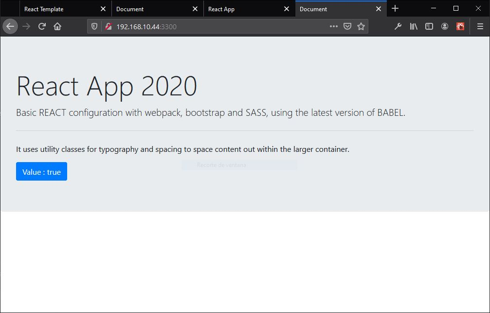

# React App client 2020

_Basic REACT configuration with webpack, bootstrap and SASS, using the latest version of BABEL._



### NPM Package

_Install npm packages_

```
// npm package babel
npm install @babel/core @babel/preset-env @babel/preset-react babel-loader core-js@3 @babel/cli -D

// webpack package
npm install webpack webpack-cli webpack-dev-server html-webpack-plugin source-map-loader -D

// css/sass package
npm install bootstrap css-loader sass-loader node-sass mini-css-extract-plugin -D

// react package
npm install react react-dom react-router-dom axios --save

// redux package
npm install redux react-redux redux-thunk --save

```

### Configurar BABEL

_Archivo .babelrc_

```
{
    "presets":[
        ["@babel/preset-env", {
            "useBuiltIns": "usage",
            "corejs": 3
        }],
       "@babel/preset-react"
    ]
 }
```